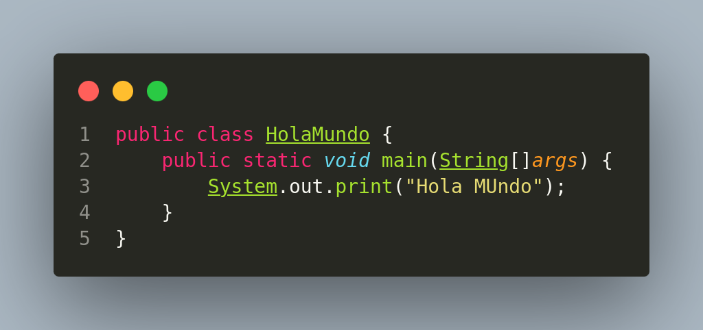

# DESPLIEGUE DE APLICACIONES WEB
INICIO DEL CURSO

## 1. MARKDOWN.
   
Es un lenguaje ligero/simple que se utiliza para crear texto enriquecido como por ejemplo HTML, con un editor de texto sin formato.


## 2. Crear un Hola Mundo en Java en VS Code

### Descargar VS Code

Para descargar **Visual Studio Code** entra a su web oficial --> [Visual Studio Code](https://code.visualstudio.com/)

---

### Crear el Hola Mundo

**1. Una vez instalado, ejecutamos VS Code**.

**2. Vamos a:**

   > File / New File / New Java File
   
**3. Declaramos la clase:**

   ```java
   public class HolaMundo {
   ```
**4. Añadimos el método `main`:**

   ```java
       public static void main(String[] args) {
   ```
**5. Escribimos la salida en consola:**

   ```java
           System.out.print("Hola Mundo");
       }
   }
   ```
**6. Guardamos el fichero con Ctrl + s y lo ejecutamos.**

---

  **CODIGO EN VS CODE**
  
  

  


  
